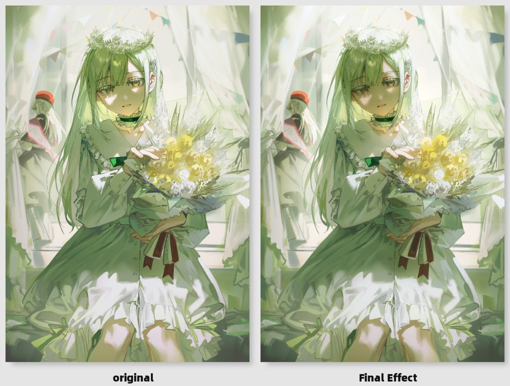
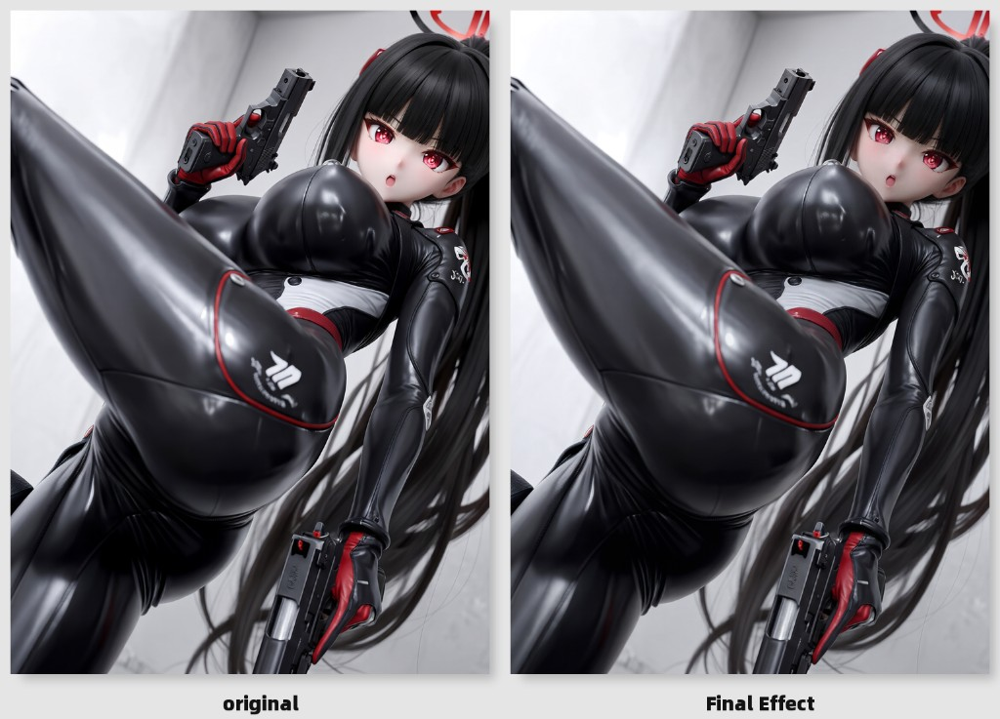
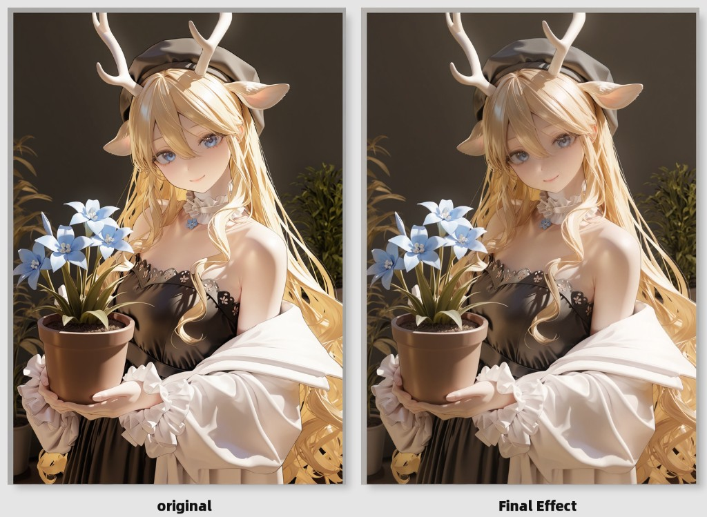
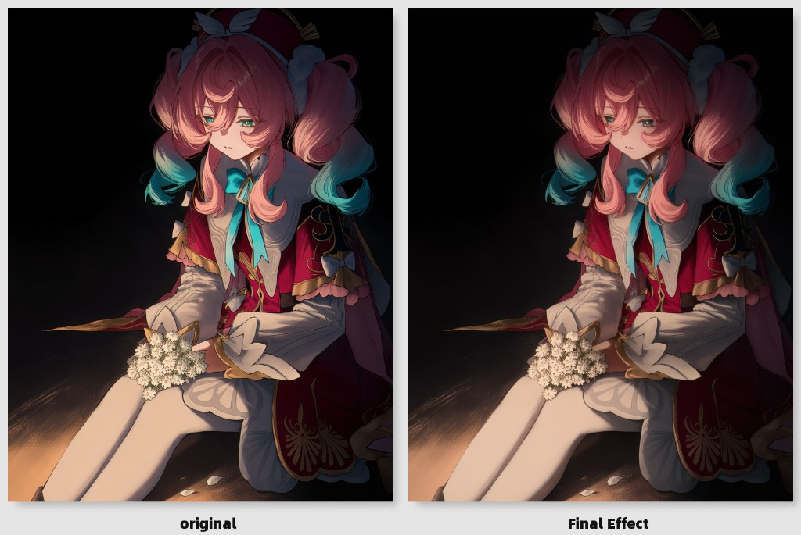
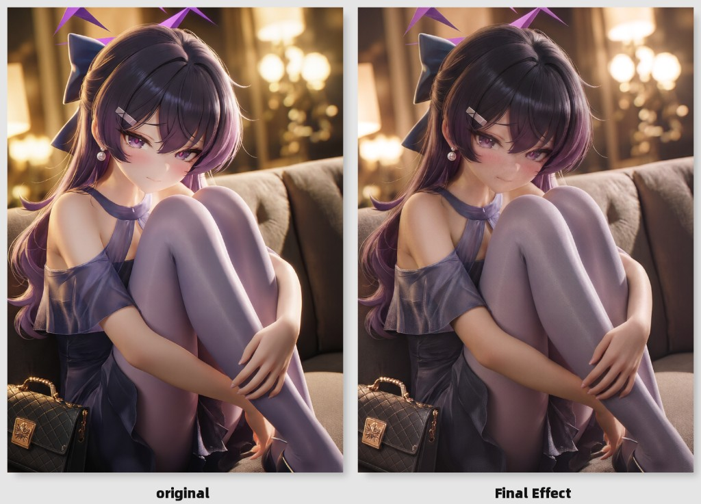
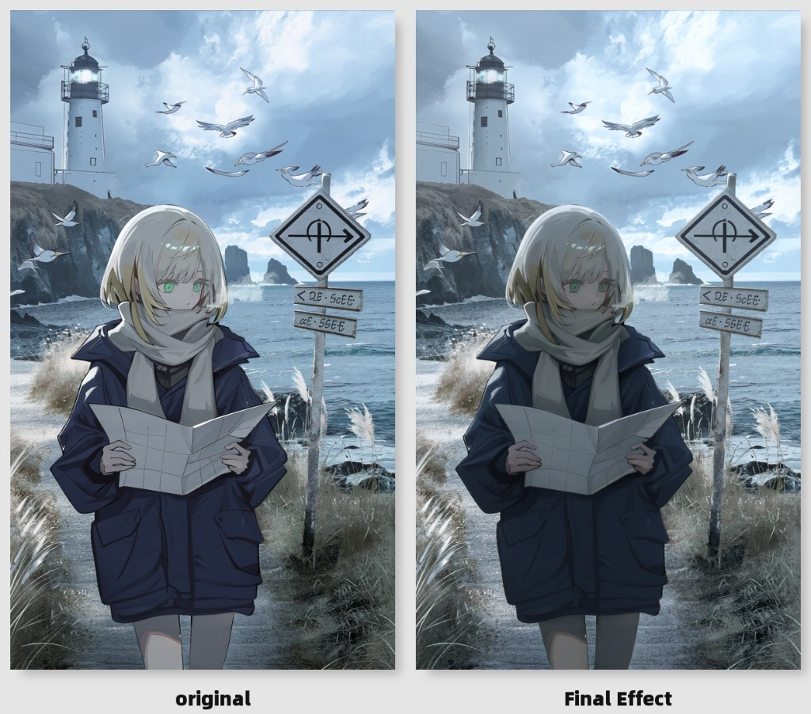
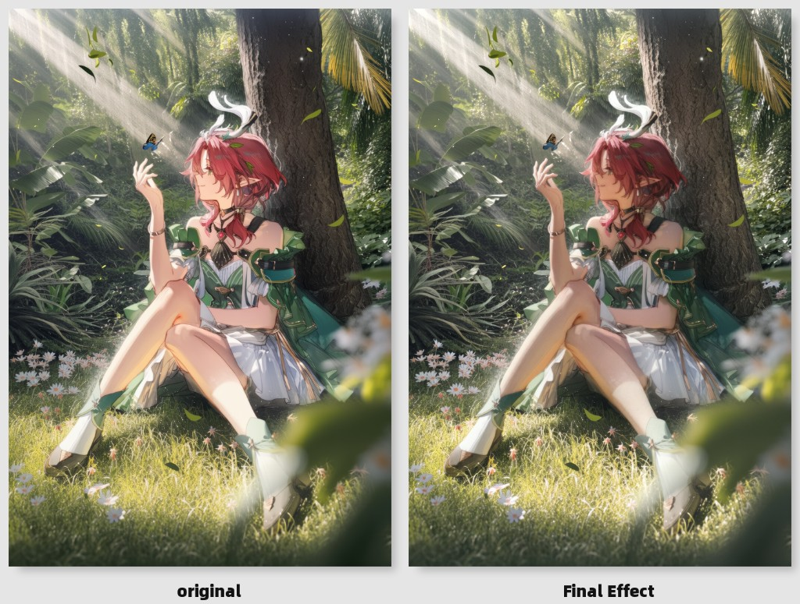

# ComfyUI-DLSS5

[purkatyy/DLSS5-](https://github.com/purkatyy/DLSS5-/releases/tag/dlss) 的 ComfyUI 节点。对静图或视频拆帧做 DLSS5 Feature 18 同分辨率神经渲染。

节点：`image` → `dlss5`。`IMAGE` 进，`IMAGE` 出。

| 节点 | 说明 |
| --- | --- |
| **DLSS5 Neural Render** | 简易版。强度/本地色调/本地结构 0–1，默认 1 |
| **DLSS5 Neural Render (Advanced)** | 高级版。`local_tone` / `local_struct` 默认 0.5、上限 2；`intensity` 上限 2；多 `preset` / `skin_struct` / `use_auto_mask` / `ui_correction` |

## 安装

Windows + NVIDIA RTX 30 / 40 / 50。需要 [VC++ 2015–2022](https://learn.microsoft.com/en-us/cpp/windows/latest-supported-vc-redist)。解 30/50 的 `.rar` 需要 [7-Zip](https://www.7-zip.org/)。

1. 把本仓库放到 `ComfyUI/custom_nodes/DLSS5-Comfyui`
2. 重启 ComfyUI
3. 第一次跑图会从上游 [release](https://github.com/purkatyy/DLSS5-/releases/tag/dlss) 按当前显卡代数拉 DLL

预拉三套：

```bash
python vendor_dlls.py
```

| 文件 | 来源 |
| --- | --- |
| `vendor/dlssnr_host.dll` | `DLSS5Tool.zip` |
| `vendor/rtx40/nvngx_dlssnr.dll` | `DLSS5Tool.zip` |
| `vendor/rtx30/nvngx_dlssnr.dll` | `RTX30xx.rar` |
| `vendor/rtx50/nvngx_dlssnr.dll` | `RTX50xx.rar` |

换 30 / 40 / 50 要重启 ComfyUI。

## 工作流

```text
LoadImage → DLSS5 Neural Render → SaveImage
LoadImage → DLSS5 Neural Render (Advanced) → SaveImage
LoadVideo → GetVideoComponents → DLSS5 Neural Render → CreateVideo
```

[`example_workflows/dlss5_image.json`](example_workflows/dlss5_image.json) 里有简易和高级两条线，左边便签注释各节点参数。

## 例图

左 original，右 Final Effect。















## 参数

共用：

| 参数 | 说明 |
| --- | --- |
| `images` | `IMAGE` 张量。视频拆帧按顺序处理；RGBA 的 Alpha 原样传出 |
| `style` | 默认 / 自然 / 电影 / 风格3 |
| `intensity` | 总强度。简易 0–1 默认 1；高级 0–2 默认 1 |
| `local_tone` | 本地色调。拉低保住原图明暗。简易 0–1 默认 1；高级 0–2 默认 0.5 |
| `local_struct` | 本地结构。拉低守轮廓，拉高更立体。简易 0–1 默认 1；高级 0–2 默认 0.5 |
| `output_view` | 处理=成品；差异×10=改动对比；左右对比=左原右结果 |
| `output_mix` | 只在「处理」时生效：`原图 + (DLSS − 原图) × mix`，0–1 |
| `gpu_gen` | Auto / RTX 30 / RTX 40 / RTX 50 |

仅 **Advanced**：

| 参数 | 说明 |
| --- | --- |
| `preset` | `0` / `1` / `2` / `3`，默认 `1`。改这项会重建 Feature |
| `skin_struct` | 皮肤结构 −1–2，默认 1 |
| `use_auto_mask` | 自动遮罩，默认关 |
| `ui_correction` | UI 校正，默认关 |

Feature 18 同分辨率下，`preset` / `skin_struct` / `use_auto_mask` / `ui_correction` 可能对画面几乎没影响。

## 许可

MIT。`nvngx_dlssnr.dll` 从原 release 获取。
